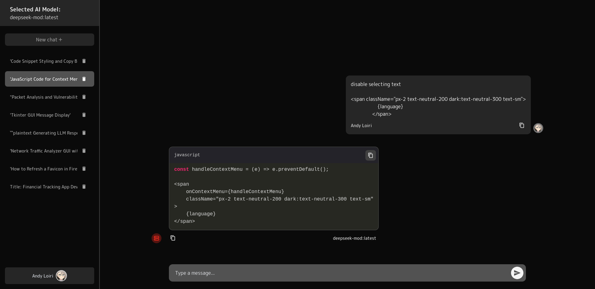

# Ollama Local Chat

A simple chat application using Ollama for local LLM inference.


## Project Structure

```
project-root/
├── app/
│   └── Http/
│       ├── Controllers/
│       ├── Middleware/
│       └── Requests/
├── resources/
│   ├── views/
│   ├── js/
│   └── css/
└── routes/
    ├── api.php
    └── web.php
```

## Requirements

- PHP >= 8.1
- Composer
- MySQL/SQLite
- Node.js & NPM (for frontend assets)

## Installation Guide

1. Clone the repository
```bash
git clone https://github.com/loireman/ollama_local_chat
cd ollama_local_chat
```

2. Install PHP dependencies
```bash
composer install
```

3. Install NPM dependencies
```bash
npm install
```

4. Environment Setup
```bash
cp .env.example .env
php artisan key:generate
```

5. Configure your `.env` file with database credentials
```env
DB_CONNECTION=sqlite
```

6. Specify the Google credentials and redirect URI
```env
GOOGLE_CLIENT_ID=your_google_client_id
GOOGLE_CLIENT_SECRET=your_google_client_secret
GOOGLE_REDIRECT_URI=https://www.loiri.com.ua/api/google/auth/callback
```

7. Run migrations
```bash
php artisan migrate
```

8. Build frontend assets
```bash
npm run dev
```

## Ollama Installation Guide

### Installing Ollama

1. **Linux**
```bash
curl -fsSL https://ollama.com/install.sh | sh
```

2. **macOS**
- Download the latest version from [Ollama.com](https://ollama.com)
- Move the downloaded app to your Applications folder

3. **Windows**
- Download and install from [Ollama.com](https://ollama.com/download/windows)
- Run the installer and follow the prompts

### Installing Models

1. Start Ollama service:
```bash
ollama serve
```

2. Pull the desired models:
```bash
# Pull DeepSeek Coder v2
ollama pull deepseek-coder-v2:latest

# Other useful models
ollama pull codellama:7b
ollama pull mistral:7b
```

3. Verify installation:
```bash
ollama list
```

### Model Usage

To test the model:
```bash
ollama run deepseek-coder "Write a hello world in Python"
```

## Running the Application

1. Start the Laravel development server
```bash
php artisan serve
```
The application will be available at `http://localhost:8000`

2. For development with Vite (if using)
```bash
npm run dev
```
or

```bash
npm run build
```

## Key Directories

### `app/Http`

- **Controllers/**: Contains all the controllers that handle requests
- **Middleware/**: Contains custom middleware classes
- **Requests/**: Contains form request validation classes

### `resources`

- **views/**: Contains all Blade template files
- **js/**: Contains TypeScript components

### `routes`

- **web.php**: Contains web routes accessible via browser
- **api.php**: Contains API routes

## Common Artisan Commands

```bash
# Run migrations
php artisan migrate

# Clear application cache
php artisan cache:clear

# Clear config cache
php artisan config:clear
```

## Additional Notes

- Make sure to set appropriate file permissions
- Configure your web server (Apache/Nginx) if deploying to production
- Set up proper security measures before going live

## Troubleshooting

Common issues and their solutions:

1. **Permission Issues**
```bash
chmod -R 777 storage bootstrap/cache
```

2. **Composer Dependencies Issues**
```bash
composer dump-autoload
```

3. **Artisan Command Not Found**
```bash
composer dump-autoload
php artisan clear-compiled
```